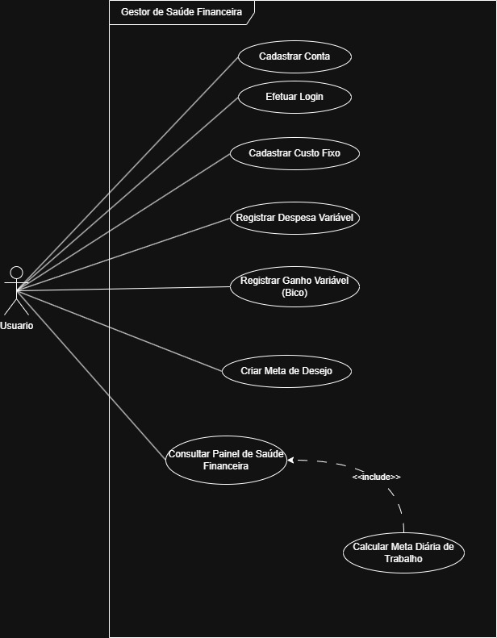

# Engenharia de Requisitos - Casos de Uso (CSU)

Este documento especifica o comportamento funcional do sistema a partir do ponto de vista do ator (Usuário).

## Diagrama Geral de Casos de Uso (UML)

---

## Detalhamento dos Casos de Uso

### Módulo de Autenticação e Perfil
* **CSU01 - Cadastrar Conta:** Permite que o trabalhador autônomo insira seus dados básicos e configure seu limite diário de trabalho.
* **CSU02 - Efetuar Login:** Realiza a autenticação segura do usuário no sistema.

### Módulo de Fluxo de Caixa (Movimentações)
* **CSU03 - Registrar Ganho Variável (Bico):** Permite o lançamento de valores recebidos por serviços esporádicos executados.
* **CSU04 - Cadastrar Custo Fixo:** Permite a inserção de despesas recorrentes (mensais, diárias ou anuais) que o usuário possui.
* **CSU05 - Registrar Despesa Variável:** Permite o lançamento de saídas financeiras esporádicas e imprevistas do cotidiano.

### Módulo de Inteligência Financeira
* **CSU06 - Criar Meta de Desejo:** Permite ao usuário cadastrar um objetivo de consumo, definindo valor total e data limite.
* **CSU07 - Consultar Painel de Saúde Financeira:** Exibe a Dashboard consolidada com os saldos atuais e o status financeiro do usuário.
* **CSU08 - Calcular Meta Diária de Trabalho [INCLUI CSU07]:** O sistema processa o algoritmo para determinar o valor líquido que o usuário precisa faturar por dia para cobrir seus custos e metas.

---

## Fluxo Principal de Caso de Uso Complexo

### Detalhamento do CSU08 - Calcular Meta Diária de Trabalho
1. **Ator Principal:** Usuário.
2. **Pré-condições:** O usuário deve possuir custos fixos e pelo menos uma meta de desejo cadastrados no sistema.
3. **Fluxo Principal:**
    * A. O usuário acessa a tela de visualização de metas ou o painel geral.
    * B. O sistema busca no banco de dados todos os custos fixos ativos do usuário (executa a inclusão do **CSU07**).
    * C. O sistema converte custos mensais e anuais em frações de custo diário proporcional.
    * D. O sistema calcula a fração necessária por dia para atingir a meta de desejo dentro do prazo estipulado.
    * E. O sistema soma a fração de custo diário com a fração da meta e exibe o valor final mastigado na tela.
4. **Pós-condição:** O valor diário alvo é exibido de forma clara ao usuário, atualizado dinamicamente.